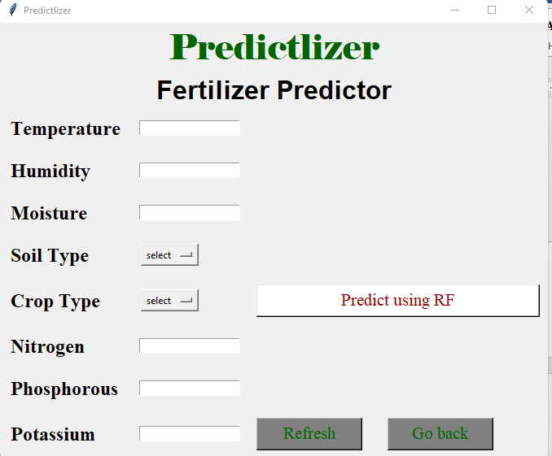
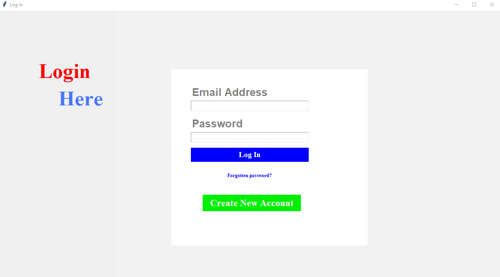
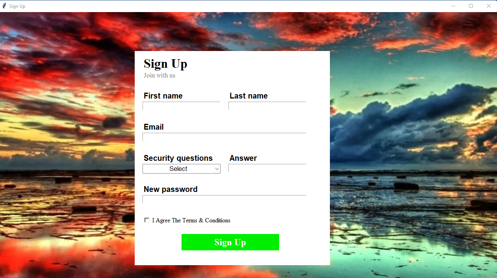

Certainly! Below is a template for your README.md file. Please replace the placeholder text with your actual project details, URLs, and image paths.

```markdown
# Crop Fertilizer Prediction

## Overview
Crop Fertilizer Prediction is a Python application that utilizes the Random Forest algorithm for predicting the optimal fertilizer for crops. The project requires Python, tkinter, pymysql, and various Python packages. The dataset is provided in CSV format.

## Prerequisites
To run this project, you need to have the following installed:

- [Python](https://www.python.org/downloads/)
- [tkinter](https://docs.python.org/3/library/tkinter.html)
- [pymysql](https://pypi.org/project/PyMySQL/)

## Installation
1. Install the required Python packages using the following command:

   ```bash
   pip install -r requirements.txt
   ```

   (Make sure to replace 'requirements.txt' with the actual name of your requirements file if it's different.)

2. Import the provided SQL file into your MySQL database. Ensure that the database name is set to 'student_database'.

## Usage
Run the application using the following command:

```bash
python mainApp.py
```

## Dataset
The dataset used in this project is available in CSV format.

## Project Screenshots






## Kaggle Link
[Link to Kaggle Dataset](#insert_kaggle_link_here)

Instructions:
1. Replace the placeholder text with your specific project details.
2. Make sure to provide the correct URLs for the prerequisite packages and the Kaggle dataset link.
